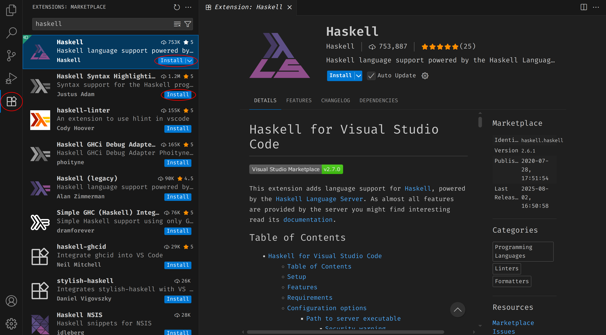

# Функционално програмиране

В този курс ще се запознаем с 2 езика - Haskell и Scheme.
За целта може да инсталирате необходимите инструменти по следните начини:

### [GHCup](https://www.haskell.org/ghcup/)

GHCup включва:

- GHC (Glasgow Haskell Compiler) - компилатор на Хаскел;
- GHCi - CLI, който използва GHC; най-често ще използваме него;
- Cabal - package manager за Haskell;
- HLS (Haskell Language Server).

### [VSCode](https://code.visualstudio.com/download)

За Haskell ще са ни нужни и две разширения във VSCode:

*Забележка*: Първото разширение директно инсталира и второто.

### [DrRacket](https://racket-lang.org/download/)
