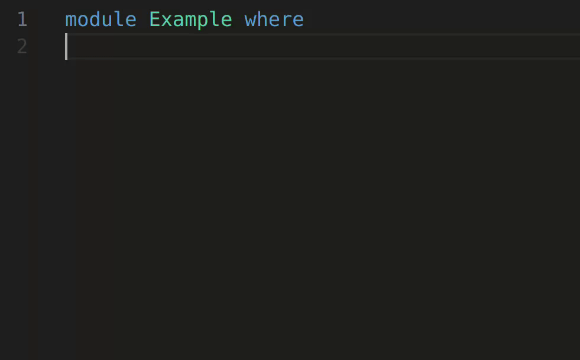
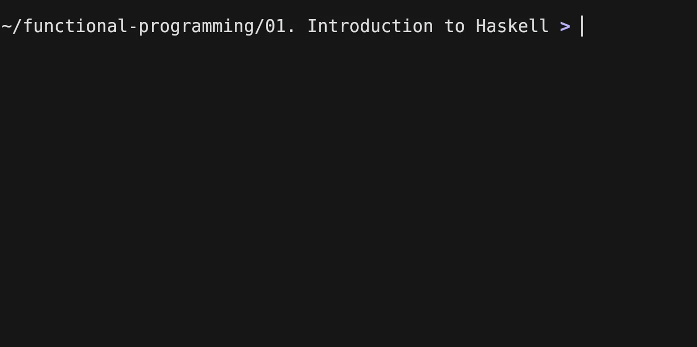

# Работа с Haskell

За разлика от познатите ви досега езици тук няма
директно да извеждаме резултатите от функциите,
които пишем, директно на стандартния изход. Тоест,
няма да имаме нещо такова в самите source файлове
(или поне засега):

```cpp
std::cout << sqrt(20) << std::endl;
```

За да видим резултата от изпълнението на дадена функция
(или стойността на някаква "променлива"), директно ще я
*оценяваме* или в GHCi, или inline в самия .hs файл.
Това отново е вид извеждане в някакъв поток, но не
е напълно еквивалентно на това, с което сте работили досега.
С входно-изходни операции ще се занимаваме по-напред
в курса.

- inline оценка на израз директно в .hs файл



- оценка в GHCi



*Забележка*: За да използвате GHCi, ви е необходим терминал.
Тоест, можете отделно да отворите терминална инстанция в зависимост
от операционната ви система или да използвате вградения във VSCode терминал
(Ctrl + `).

## Полезни команди в GHCi

- зареждане на модули

```hs
shell_prompt> ghci <module1>.hs <module2>.hs ...
```

```
shell_prompt> ghci
GHCi, version 9.6.7: https://www.haskell.org/ghc/  :? for help
ghci> :l <module1>.hs <module2>.hs ...  -- или :load ...
```

- повторно зареждане на предишно заредените модули

```
ghci> :r
ghci> :reload
```

- тип на стойност/функция

```
ghci> :type "abcd"
"abcd" :: String
ghci> :t even
even :: Integral a => a -> Bool
```

- информация за функция/типов клас/тип данни

```
ghci> :info even
even :: Integral a => a -> Bool         -- Defined in ‘GHC.Real’
ghci> :i Integral
type Integral :: * -> Constraint
class (Real a, Enum a) => Integral a where
  quot :: a -> a -> a
...
```

- изход от GHCi

```
ghci> :q  -- или :quit
```

- импортиране на модули

```
ghci> Data.Char.ord 'a'
97
ghci> import Data.Char
ghci> ord 'a'
97
```

- дефиниции

```
ghci> let x = 42
ghci> y = 100
ghci> x + y
142
ghci> let foo x y z = x + y * z
ghci> foo 1 2 3
7
```

и още много други команди, за които може да видите повече информация
чрез командата `:?`.
